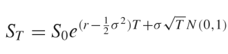
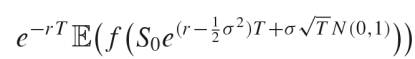
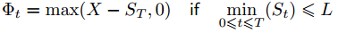
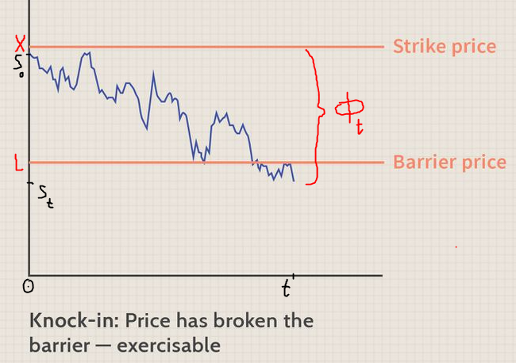
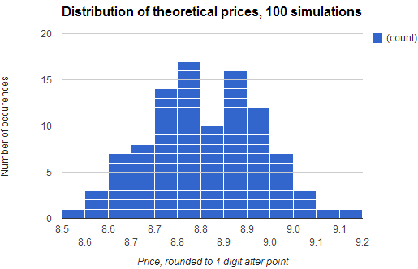
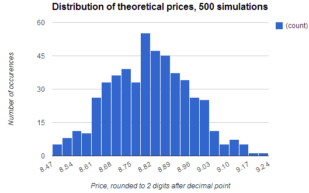

# Approximation of the theoretical price of the down-and-in barrier put option with a continuous barrier using Monte Carlo simulation in C++

Monte Carlo Simulation generates several thousand paths of daily price changes according to Wiener process (geometric Brownian motion) with constant drift and volatility. The last price of underlying under such path is thus going to be:



<div style="text-align: right"> Source: C++ Design Patterns and Derivatives Pricing by M. S. Joshi </div>

In the above formula S<sub>0</sub> stands for initial price of underlying asset, `r` is risk-free rate, `sigma` is volatility of underlying asset and the most right-hand side part represents Brownian motion distributed as Gaussian with mean zero and variance `T`. Also, we use continuous compounding for discounting the expected price of underlying to get its present value today:


<div style="text-align: right"> Source: C++ Design Patterns and Derivatives Pricing by M. S. Joshi </div>

## Option description

The given option is a down-and-in barrier put, where the price has to decrease to reach the barrier and set the option “activated”. The payoff is then difference between strike price and the price of underlying asset at option’s maturity:

,
<div style="text-align: right"> where ***X*** stands for strike price </div>


<div style="text-align: right"> Source: Investopedia (own markup) </div>

In the graph above `X` stands for strike price, `L` denotes the continuous barrier level and S<sub>t</sub> is the price of underlying asset at option’s maturity.

The given option encompassed the following characteristics:

- price of the underlying at the moment of option pricing: S<sub>0</sub> = 195,
- strike price `X` = 200,
- annualized volatility rate `σ` = 0.2
- annualized risk-free rate `r` = 0.06
- time to maturity `t` = 0.5

For the purposes of example, by default, the barrier is set at 175.

By default (when the user is asked to provide the program with the option characteristics and enters `expiry` = 0), the program simulates the payoffs and approximates the value of the option described above! This kind of simulation is described further below in section ”Simulation results”.

## Source code description and explanation

`DownAndInBarrierPut` C++ project consists of 4 source files with corresponding 3 header files and uses external libraries `<vector>`, `<iostream>`, `<cmath>`, `<algorithms>`, `<cstdlib>`, `<ctime>`, `<fstream>` - last one is used to write results to file `simulation.txt`, more on that later on.

The main function code is set in the `Main.cpp` file. It is responsible for command-line user interface. After program initialization, it asks the user to enter the characteristics of option. If 0 is entered, the default simulation is run with parameters described in the end of section 3.

```cpp
if(Expiry) // If expiry = 0 is entered, the program runs monte carlo simulation with default characteristics of option, see below
{
	cout << "\nNumber of working days (daily price changes, e.g. 126 for half a year):\n";
	cin >> workingDays;

// if non-zero expiry is entered, the user is expected to provide the all other option’s characteristics & also number of price paths to be generated

...

BarrierOption myOption(workingDays, Strike, Spot, Volat, r, Expiry, Barrier);

...}

// If no characteristics were defined, run monte carlo with default characteristics of option

else{
	NumberOfPaths = 20000;
	BarrierOption myOption(126, 200, 195, 0.2, 0.06, 0.5, 175);

...}
```

User is also asked to enter the number of paths to be generated during the simulation as the computing abilities are dependent on end-user machine. Generating more than a million of paths is not recommended as this amount of operations takes more than minute to be processed.

As it’s visible in the code fragment above, after the option’s characteristics were entered, the `myOption` instance of class `BarrierOption` is created, where the object’s constructor is called with values of characteristics that the user had entered.

Please note, the constructor requires user to enter the value for `nInt` member, which is simply the number of price changes to be processed in each generated path. It is actually the number of working days before the expiration, number of days when the underlying asset is traded.

After that `myOption.MonteCarloThisBarrierPutSeveralTimes(NumberOfPaths)` line of code calls Monte Carlo simulation of the option created from user-defined characteristics and this method takes variable `NumberOfPaths` of type `unsigned long`. This method is defined in the `BarrierOption.cpp` file (also the constructor mentioned above is there as well).

`BarrierOption.cpp` file provides definitions for the following methods:
```cpp
BarrierOption::generatePath() // Generates price changes path
BarrierOption::printPath() // Prints path of price changes
```
> The program uses `printPath` if the number of paths to be generated entered by user is lower than five. This was useful in the debugging process as it was possible to observe the generated prices path and whether the `BarrierOption::getLastPrice()` method actually performed correctly, taking the last price of underlying, for it later to be compared with strike price to determine the theoretical payoff for the option for each generated path.
```cpp
double BarrierOption::getLastPrice(){
	double price = 0.0;
	price = thisPath.back();
	return price; 
}
```
> It wasn’t really necessary to create this separate method, but this was just the way it was done. Extra information is provided in the paragraph above.
```cpp
bool BarrierOption::checkIfBarrierCrossed(){
	double lowestUnderlyingPrice = 0.0;
	lowestUnderlyingPrice = *std::min_element(std::begin(thisPath), std::end(thisPath));
	if (lowestUnderlyingPrice < barrier) return true;
	else return false;
}
```
> This method checks whether in the generated path the barrier was crossed and option was activated. It returns boolean values `TRUE` or `FALSE`. `TRUE` means that the barrier was crossed (price of underlying in the generated path dropped below the barrier level) and `FALSE` means the opposite. It’s used later when determining the option payoff: if option was not activated (the method above returned `FALSE`), the payoff is zero.
>
> Inside the code for the method the `std::min_element` is used which returns the iterator, so using `*` pointer asterisk is required. The iterator is the order (position) of the minimum element in the vector with path of generated prices, returned by `std::min_element`, which takes two parameters, determining the range (start and end) of elements in vector, from which the minimum element is returned. We need the value of this minimum element, not its position, so, again, that’s why the pointer is used `*std::min_element`
```cpp
double BarrierOption::MonteCarloThisBarrierPutSeveralTimes(int nReps){

	double rollingSum = 0.0;
	double thisLast = 0.0;
	bool barrierCrossed = false;

	for(int i = 0; i < nReps; i++){

		generatePath();
		thisLast = getLastPrice();
		barrierCrossed = checkIfBarrierCrossed();

		if (barrierCrossed) {
			rollingSum += (thisLast < strike)? (strike - thisLast) : 0;
		}

		if (nReps < 5){
			printPath();
			cout << "Last price of underlying in this generated path = " << thisPath.back() << "\n";
		}

	}

	return (rollingSum/double(nReps))/exp(r*expiry);
}
```
> The last method defined in `BarrierOption.cpp` runs Monte Carlo simulations `nReps` times, where user-defined `NumberOfPaths` is passed to this method as it was described in `Main.cpp`.
>
> Method is called once and it initializes `rollingSum`, `thisLast` and `barrierCrossed` with zero or `false`. Then it runs the loop `NumberOfPaths` times, each time adding the option payoff from newly run path of generated prices to `rollingSum`. So this `rollingSum` in the end is the sum of option payoffs from all generated underlying prices paths. When it is divided by the `NumberOfPaths`, it tells us the average payoff in this simulation and thus the theoretical option price.
>
> Please notice, the `rollingSum` is “updated” only if the option was activated in the generated path (`barrierCrossed = TRUE`). Then if the last price of underlying asset (price of underlying at option’s maturity) `thisLast` is larger than strike price, the payoff added to `runningSum` is zero.
>
> Also, if number of paths to be generated (`nReps`) is lower than five, then each path will be printed, and the last price of underlying in this generated path can be manually checked. As stated before, it was useful for the developer in the debugging process.
>
> Please notice, in the end of the code fragment above, the return value (average option payoff) is discounted so we obtain the present value of discounted payoff or the theoretical price of the option.

Important!

Above only the general code was described. For simulation purposes, the following amendments were made to the code: if default simulation is selected, the programs runs a loop of 100 simulations each generating 20000 paths of underlying asset price and thus option payoff and option price. Those 100 theoretical prices of option with default characteristics as described in a previous section and project assignment are appended (written) to file `simulation.txt` located in `DownAndInBarrierPut` folder. I later take those prices and calculate standard deviation of simulations and build a chart (provided in the next section below). In the next paragraph, the above-mentioned code changes are briefly displayed:

`Main.cpp`, line 87, inside `else {}` statement from above:
```cpp
for(int i = 0; i \< 50; i++){ // two simulation one called by
overloading operator, 50 times x 2 = 100 simulations. 100 results will
be written to file

	cout \<\< "The Price of Down-And-In Barrier Put = " \<\<
myOption.MonteCarloThisBarrierPutSeveralTimes(NumberOfPaths) \<\< "\n";

	cout \<\< "Price of Down-And-In Barrier Put = " \<\< myOption('I', 'P',
NumberOfPaths) \<\< "\n";}
```
`BarrierOption.cpp`, line 93,
`BarrierOption::MonteCarloThisBarrierPutSeveralTimes(int nReps)` method
definition, just before return statement (see page 5 of this report):
```cpp
ofstream myfile;

myfile.open ("simulation.txt", std::ios_base::app); // append file

myfile \<\< (rollingSum/double(nReps))/exp(r\*expiry) \<\< "\n"; // with
price

myfile.close(); // close file
```

## Simulation results

Set `expiry = 0`, when entering option characteristics while running the program to run this default simulation.

- price of the underlying at the moment of option pricing: S<sub>0</sub> = 195,
- strike price X = 200,
- annualized volatility rate σ = 0.2
- annualized risk-free rate r = 0.06
- time to maturity t = 0.5
- barrier was set at 175.

The program runs a loop of 100 simulations each generating 20000 paths of underlying asset price and thus option payoff and option price. Those 100 theoretical prices (of option with default characteristics, as described above and as in the project assignment), are appended (written) to file `simulation.txt` located in `DownAndInBarrierPut` folder. I'm later using those prices to calculate standard deviation of simulations and build a chart displaying the distribution of those theoretical prices:



The standard deviation for the prices, obtained above is 0.12054. The mean price among 100 simulations was $8.81047. The lowest theoretical price was $8.52 and the highest $9.20. Admittingly, the range between lowest and highest is quite large, almost 10% of mean price.

As it is visible on figure above, on 100 simulations, the prices do not really follow classical normal distribution, the kurtosis is too large.

Next, I run loop with 500 simulations, each calculating 10000 paths to determine each theoretical option price. Hence, I obtain 500 prices, illustrated on the figure below:



The standard deviation for the prices, obtained above is 0.14223. The mean price among 500 simulations was $8.81596. The lowest theoretical price was $8.48 and the highest $9.22.

Actually, the results are not much different from the previous experiment.

PS I tried simulating for option which has the barrier = strike (plain vanilla put option) and the results were in line with Black-and-Scholes model.
